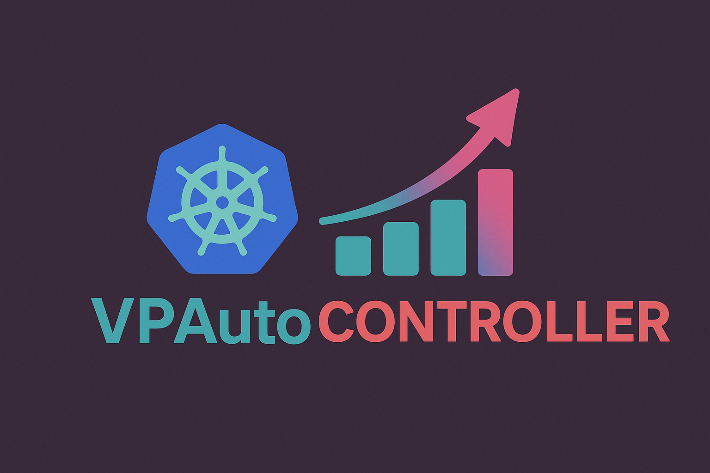

# VPA Auto Creation Controller

This Kubernetes controller automatically creates a `VerticalPodAutoscaler` (VPA) resource for any `Deployment`, `DaemonSet`, or `StatefulSet` that opts in using an annotation.

## Features

- Auto-creates VPA for annotated workloads;
- Cleans up orphaned VPAs;
- Sets `OwnerReference` for automatic VPA deletion;
- Supports Deployments, DaemonSets, and StatefulSets.

## Getting Started

### Prerequisites
- go version v1.22.0+
- docker version 17.03+.
- kubectl version v1.11.3+.
- Access to a Kubernetes v1.11.3+ cluster;
- Vertical Pod Autoscaller controller and CRDs installed.

### How It Works

Any `Deployment`, `DaemonSet`, or `StatefulSet` with this annotation:

```yaml
metadata:
  annotations:
    k8s.autoscaling.vpacreation/vpa-enabled: "true"
```

will automatically get a matching [VPA resource](https://github.com/kubernetes/autoscaler/tree/master/vertical-pod-autoscaler).

When the workload is deleted, the VPA is also deleted automatically.

### Usage and Test

1. Locally build the controller:

``` bash
$ make docker-build
$ make deploy IMG=your-image:tag
```

2. Annotate your workload:

```yaml
metadata:
  annotations:
    k8s.autoscaling.vpacreation/vpa-enabled: "true"
```

3. Deploy your workload and verify VPA creation:

```bash
$ kubectl apply <your_workload>.yaml
$ kubectl get vpa
```

### Full example

Below is an example with a nginx deployment:

```yaml
apiVersion: apps/v1
kind: Deployment
metadata:
  name: test-vpa
  namespace: tetris
  annotations:
    k8s.autoscaling.vpacreation/vpa-enabled: "true"
spec:
  replicas: 1
  selector:
    matchLabels:
      app: test
  template:
    metadata:
      labels:
        app: test
    spec:
      containers:
        - name: nginx
          image: nginx
```

## RBAC Requirements

The controller needs permission to:
- Read `Deployment`, `DaemonSet`, or `StatefulSet`;
- Create and delete `VerticalPodAutoscalers`

## Cleanup

VPAs are deleted automatically when their owning workload is deleted — no manual cleanup needed.

## License

Copyright 2025.

Licensed under the Apache License, Version 2.0 (the "License");
you may not use this file except in compliance with the License.
You may obtain a copy of the License at

    http://www.apache.org/licenses/LICENSE-2.0

Unless required by applicable law or agreed to in writing, software
distributed under the License is distributed on an "AS IS" BASIS,
WITHOUT WARRANTIES OR CONDITIONS OF ANY KIND, either express or implied.
See the License for the specific language governing permissions and
limitations under the License.

